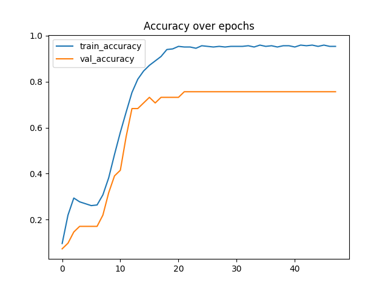
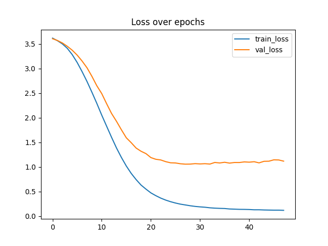
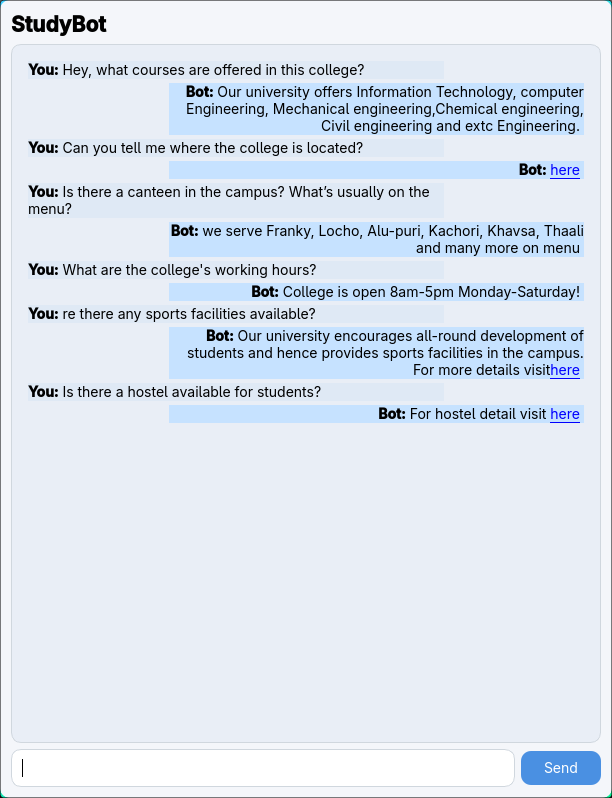
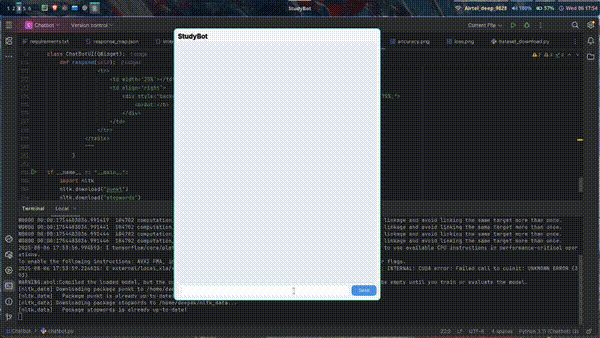

# StudyBot – AI Chatbot for Student Queries


> **Repository Name**: `Skilltexon/StudyBot`  
> **Internship Platform**: [Skilltexon](https://www.linkedin.com/company/skilltexon/posts/?feedView=all) – Empowering Students with Project-Based Internships  
> **Duration**: Major Project for AI/ML Internship  
> **Project Domain**: Natural Language Processing, Intent Detection, GUI Application  
> **Dataset Used**: [`niraliivaghani/chatbot-dataset`](https://www.kaggle.com/datasets/niraliivaghani/chatbot-dataset)  
> **Acknowledgement**: Full credit to the dataset author for curating quality educational intent-response mappings.

---

## Project Overview

StudyBot is an intelligent chatbot system trained on student queries using NLP techniques. It answers predefined academic or support questions, designed under the Skilltexon AI/ML internship framework. The goal was to simulate a helpful assistant within a structured intent-response framework using a lightweight ML pipeline.

The chatbot operates via a beautiful and minimal PyQt5 desktop UI, allowing users to type queries and receive instant intelligent responses. Model predictions are powered by TF-IDF feature extraction and a Multinomial Naive Bayes classifier trained on cleaned and vectorized text inputs.

---

## Directory Structure

```
Chatbot/
│
├── chatbot.py              # PyQt5 UI application
├── data_preprocessing.py   # Model training + vectorization
├── dataset_download.py     # Script to pull and preprocess dataset
│
├── intents.json            # Intent definition file (original structure)
├── response_map.json       # Intent-to-response mapping used at inference
├── label_encoder.pkl       # Trained label encoder for intent mapping
├── vectorizer.pkl          # TF-IDF vectorizer
├── model.h5                # Trained intent classification model
│
├── requirements.txt        # All dependencies to recreate environment
│
├── logs/
│   ├── train/
│   │   └── events.out.*    # TensorBoard training logs (optional re-train)
│   └── validation/
│       ├── accuracy.png    # Accuracy curve
│       ├── loss.png        # Loss curve
│       └── events.out.*    # Validation logs


```

---

## Key Features

- **Intent-based chatbot** trained on structured QA dataset.
- Uses **TF-IDF + MultinomialNB** for lightweight, interpretable predictions.
- **Interactive PyQt5 GUI** styled like modern messengers.
- Visualized logs with **TensorBoard** support for training reproducibility.
- Persistent model via `model.h5`, `vectorizer.pkl`, and `label_encoder.pkl`.
- **Modular design** for easy re-training (`data_preprocessing.py`).
- Dataset sourced from [`niraliivaghani/chatbot-dataset`](https://github.com/niraliivaghani/chatbot-dataset) with proper attribution.

---




## ScreenShot



## Limitations

This chatbot is trained using limited labeled intents. While this is ideal for targeted educational queries, the bot responds only to a **finite, controlled set of intents**.
  
**By restricting the scope to predefined academic questions, StudyBot remains fast, lightweight, and completely offline—perfect for embedded use or educational kiosks.**

---

## Customization

StudyBot is designed to be easily extensible.

The base dataset includes general educational intents. However, you can expand it with:

- **Institute-specific info**: e.g. admissions, course catalog
- **Location-specific queries**: e.g. address, contact info
- **Events & Notices**: e.g. exams, orientation, workshops

> Note: In this demo version, default placeholder data is used for such categories. You can replace them in `response_map.json` and retrain the model.

---

## Dependencies

Install using pip and the provided `requirements.txt`:

```bash
pip install -r requirements.txt
```

Key packages used:
- `nltk`
- `scikit-learn`
- `keras`, `tensorflow`
- `PyQt5`
- `numpy`, `pandas`

---

## How to Run

1. Download dataset
   ```bash
   python dataset_download.py
   ```

2. Train your own model using:
   ```bash
   python data_preprocessing.py
   ```
   Logs will be saved under `logs/` and a model as `model.h5`.

3. Launch the chatbot UI:
   ```bash
   python chatbot.py
   ```

---


## Demo


---

## Acknowledgements

- **Dataset**: [niraliivaghani/chatbot-dataset](https://www.kaggle.com/datasets/niraliivaghani/chatbot-dataset)
- **Internship**: [Skilltexon AI/ML Internship](https://www.linkedin.com/company/skilltexon/posts/?feedView=all)
- **Tools Used**: `NLTK`, `PyQt5`, `Keras`, `TensorBoard`, `Scikit-learn`

---

## Author

**Name**: Deepak Sharms
**Email**: deepak20044002@gmail.com  
**LinkedIn**: [linkedin.com/in/Deepak-Sharma](https://www.linkedin.com/in/deepak-sharma-0444b632a/)  
**GitHub**: [github.com/deepak200440022](https://github.com/Deepak200440022/SKILLTEXON)  
**Institution**: Gurugram University, Gurugram, Haryana  
**Role**: Final Year AI/ML Undergraduate Intern at Skilltexon
