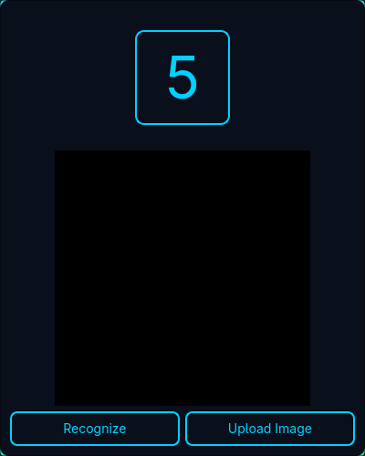
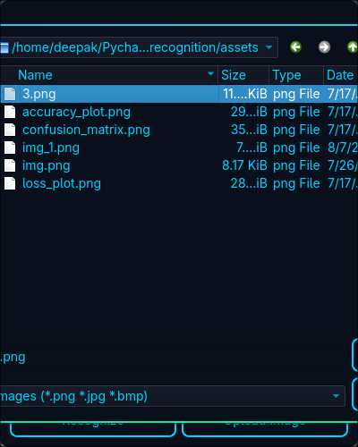
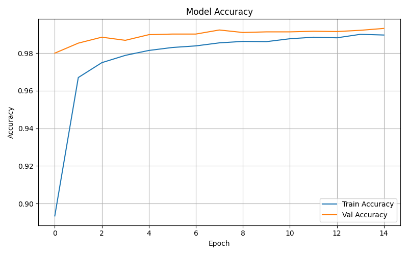
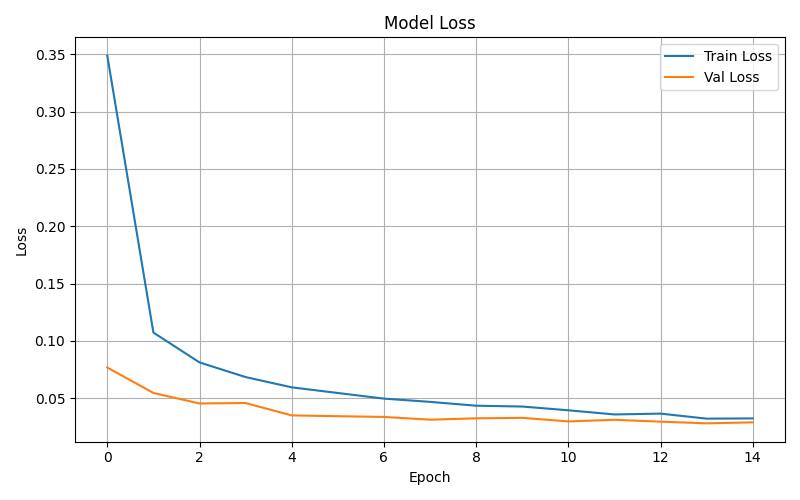
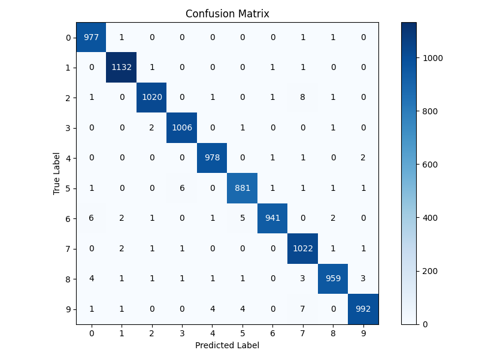
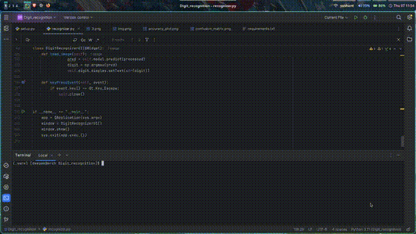

# Digit Recognizer - Handwritten Digit Classification

A GUI-based handwritten digit recognition application built using PyQt5 and trained on the MNIST dataset. This project was developed as part of an AI/ML Internship at SkillTexon.

## Project Overview

This project allows users to draw digits or upload an image to get real-time predictions using a CNN model trained on the MNIST dataset. The model predicts digits (0–9) with high accuracy using a clean and responsive interface.

## Dataset

- Name: MNIST
- Source: Keras Datasets
- Description: 70,000 grayscale images of handwritten digits (60,000 training, 10,000 testing), each 28x28 pixels.

## Tech Stack

| Component      | Technology       |
|----------------|------------------|
| Interface      | PyQt5            |
| Backend Model  | Keras + TensorFlow |
| Language       | Python           |
| Visualizations | Matplotlib       |
| Dataset        | MNIST (via Keras) |

## Project Structure

```
.
├── assets/
├── best_model.h5
├── recognizer.py           # UI and model integration
├── training.py             # CNN model training script
├── requirements.txt
├── setup.py                # Installer (optional)
```

## Model Training Summary

- Epochs: 15
- Validation Accuracy: >98.9%
- Loss Function: Categorical Crossentropy
- Optimizer: Adam
- Architecture: Conv2D → MaxPooling → Conv2D → MaxPooling → Dropout → Dense

## Screenshots

| Drawing Interface           | Digit Predicted                       |
|-----------------------------|---------------------------------------|
|  |  |

| Accuracy Plot             | Loss Plot                 |
|---------------------------|----------------------------|
|  |  |

| Confusion Matrix |
|------------------|
|  |

## Demo Video


## Author

Name: Deepak Sharma
Role: Intern, SkillTexon AI/ML Internship  
GitHub: https://github.com/Deepak200440022/SKILLTEXON   
Email: deepak20044002@gmail.com

## Installation

```bash
git clone https://github.com/Deepak200440022/SKILLTEXON.git
cd SKILLTEXON/Digit-recognition/
pip install -r requirements.txt
python recognizer.py
```

## Features

- Draw digits directly on screen
- Upload existing digit images
- Real-time prediction with confidence
- Elegant dark-themed GUI
- Fully offline functionality

## License

This project is licensed for academic and learning use under the MIT License.
