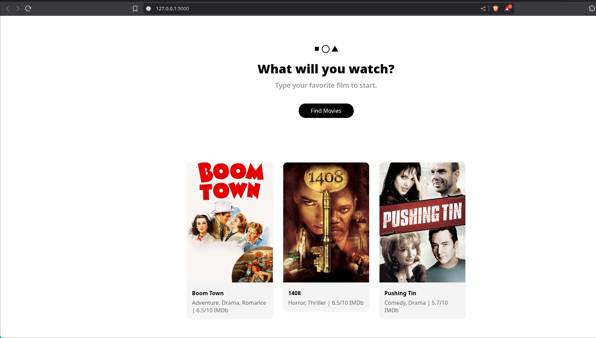
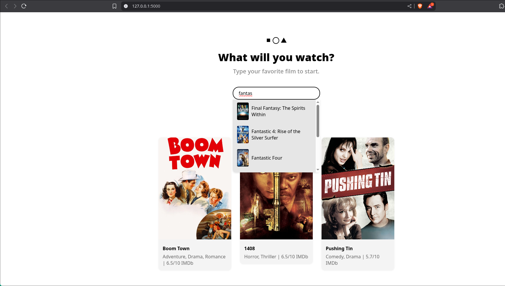
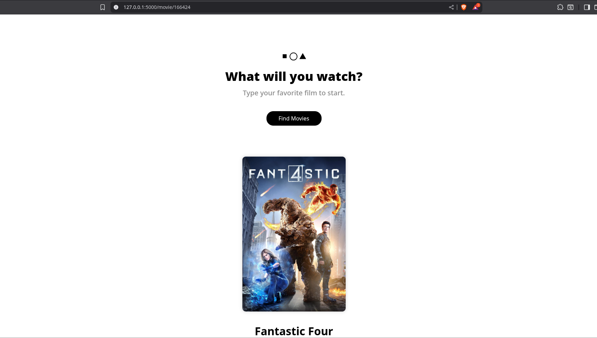
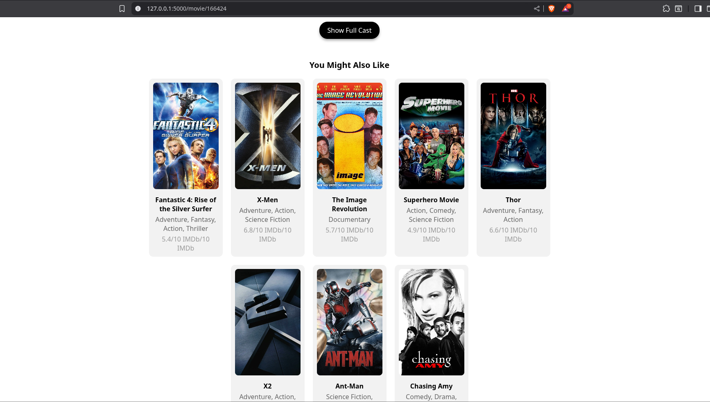
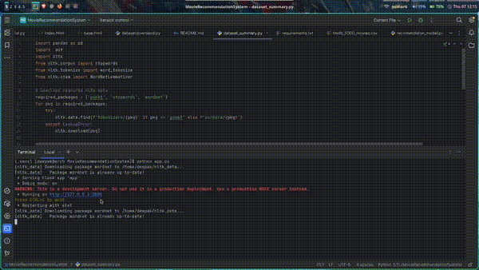

# Movie Recommendation System

> **Internship Organization**: [Skilltexon](https://www.linkedin.com/company/skilltexon/) – Empowering Students through Project-Based AI/ML Internships  
> **Project Type**: Minor Project (AI/ML Track)  
> **Internship Role**: AI/ML Intern  
> **Duration**: 30–60 Days (as per Skilltexon internship structure)  
> **Project Domain**: Recommender Systems, Information Retrieval, Web Deployment

---

## Project Overview

This movie recommendation system was developed as a Minor Project under the Skilltexon AI/ML Internship Program. It recommends similar movies based on genre, cast, keywords, language, and other metadata using TF-IDF vectorization and cosine similarity. The front end is a fully interactive and responsive UI built using HTML, CSS, and JavaScript, hosted through a Flask backend.

Users can:
- Search and auto-complete movie titles
- Get 10 most similar movie recommendations
- View detailed movie pages including overviews, cast tables, and 18+ indicators
- Navigate results using mouse, keyboard, and real-time suggestions

---

## Dataset Sources

We used data from two high-quality open datasets:

1. [`asaniczka/tmdb-movies-dataset-2023-930k-movies`](https://www.kaggle.com/datasets/asaniczka/tmdb-movies-dataset-2023-930k-movies)  
   - Contains rich movie metadata and poster paths  
   - Downloaded via:  
     ``` python
     path = kagglehub.dataset_download("asaniczka/tmdb-movies-dataset-2023-930k-movies")
     ```

2. [`tmdb/tmdb-movie-metadata`](https://www.kaggle.com/datasets/tmdb/tmdb-movie-metadata)  
   - Includes `tmdb_5000_movies.csv` and `tmdb_5000_credits.csv`  
   - Downloaded via:  
     ``` python
     path1 = kagglehub.dataset_download("tmdb/tmdb-movie-metadata")
     ```

---

## Directory Structure

```
.
├── dataset/
│   ├── tmdb_5000_credits.csv
│   ├── tmdb_5000_movies.csv
│   └── TMDB_movie_dataset_v11.csv
│
├── templates/
│   ├── base.html
│   ├── index.html
│   └── movie_detail.html
│
├── static/
│   ├── base.css
│   ├── base.js
│   ├── movie_detail.css
│   └── movie_detail.js
├── app.py
├── dataset_summary.py
├── datasetdownload.py
├── merged_dataset.csv
├── movie_model.py
├── recomendaton_model.py
├── requirements.txt
```

---

## Features

- Movie Search Bar with autocomplete suggestions and keyboard navigation.
- Recommendation Engine based on TF-IDF + cosine similarity on tags.
- Interactive UI with movie posters, genre, rating, and adult badges.
- Detailed Movie Page including overview, cast table, floating buttons, and 10 recommendations.
- Cast Table Toggle with dynamic scroll handling.

---

## Technologies Used

- Python, Flask
- Pandas, NumPy, NLTK
- scikit-learn (TF-IDF, Cosine Similarity)
- HTML, CSS, JavaScript
- Jinja2 Templating, Responsive Design

---
## Screenshots


## How to Run

1. Install dependencies:
   ```bash
   pip install -r requirements.txt
   ```

2. download dataset:
   ```bash
   python datasetdownload.py
   ```

3. Run Flask app:
   ```bash
   python app.py
   ```

4. Open your browser at:
   ```
   http://127.0.0.1:5000/
   ```

---

## Dataset Preprocessing

- `movie_model.py`:
  - Cleans and combines metadata fields like genres, cast, keywords, language, overview, tagline, and title.
  - Uses NLTK for tokenization, stopword removal, lemmatization.

- `recomendaton_model.py`:
  - TF-IDF vectorizer with English stopwords
  - Cosine similarity for recommendation ranking
  - Returns top 10 movies similar to input

- `dataset_summary.py`:  
  - Prints merged dataset schema, null stats, and content breakdown on `__main__`.

---

## Internship Attribution

This project was built during my internship at Skilltexon, an ed-tech platform focused on hands-on, project-based learning in AI/ML.

- **Internship Provider**: [Skilltexon](https://www.linkedin.com/company/skilltexon/)  
- **Internship Focus**: Real-world AI/ML applications  
- **Company Mission**:  
  "To empower students with real-world skills through hands-on project-based internships, bridging the gap between academic knowledge and industry requirements."

---

## Screenshots

The following screenshots provide a visual overview of the application's interface and functionality:

### 1. **Home Page**
Displays the main landing interface, navigation bar, and primary call-to-action elements.


### 2. **Text Input Interface**
Showcases the message input area for spam/ham classification, with animated UI elements.


### 3. **File Upload Section**
Demonstrates the file upload feature with drag-and-drop support and file preview.


### 4. **Classification Result Dialog**
Illustrates the result popup with GSAP animation, background blur, and dismiss button.



## Author

**Name**: Deepak Sharma  
**Email**: deepak20044002@gmail.com  
**LinkedIn**: [linkedin.com/in/deepak-sharma](https://www.linkedin.com/in/deepak-sharma-0444b632a/)  
**GitHub**: [github.com/deepak200440022](https://github.com/Deepak200440022/SKILLTEXON)  
**Institution**: Gurugram University, Gurugram , Haryana
**Role**: Final Year AI/ML Undergraduate Intern at Skilltexon

---

## Demo

A video showcasing search, recommendation, and UI navigation:   


---

## License

This project is built for educational purposes under the Skilltexon AI/ML internship. Dataset attribution and licensing remains with original Kaggle contributors.
