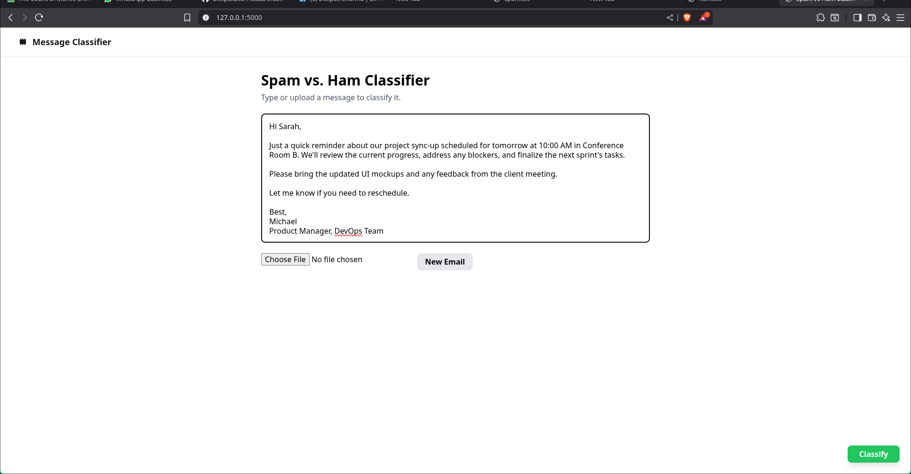
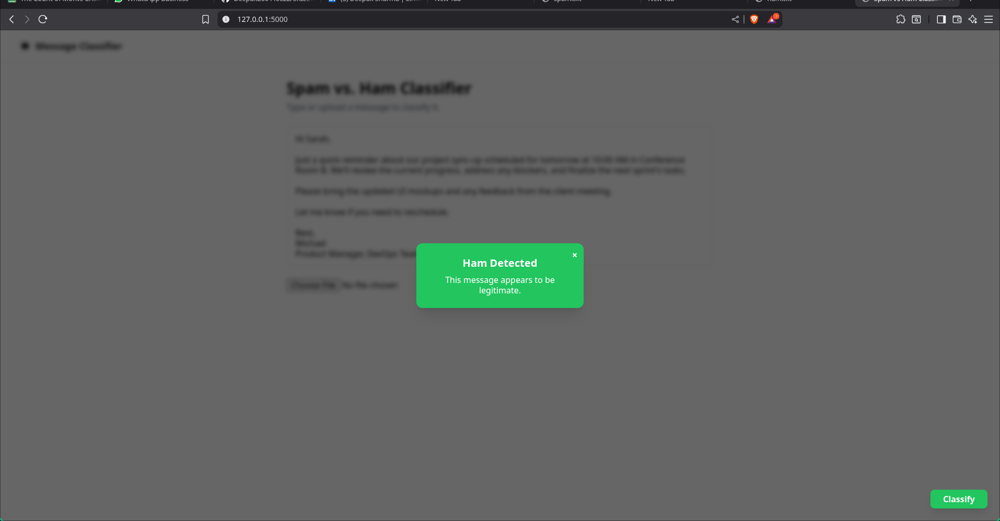
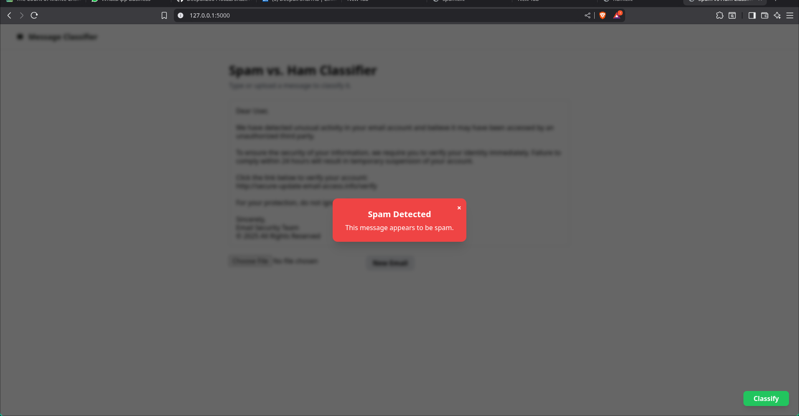
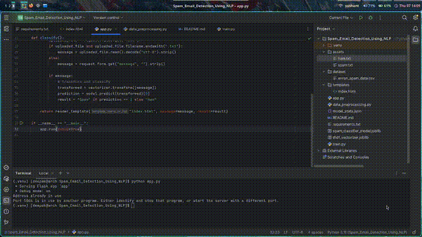

# Spam Email Classifier Web App

> **Internship Organization**: [Skilltexon](https://www.linkedin.com/company/skilltexon/) – Empowering Students through Project-Based AI/ML Internships  
> **Project Type**: Minor Project (AI/ML Track)  
> **Internship Role**: AI/ML Intern  
> **Duration**: 30–60 Days (as per Skilltexon internship structure)  
> **Project Domain**: Natural Language Processing, Text Classification, Web Application

---

## Project Overview

This spam email classifier system was developed under the Skilltexon AI/ML Internship as a practical application of natural language processing and classification. Using the Naive Bayes algorithm and TF-IDF vectorization, this system detects whether a given email message is spam or ham (non-spam).

The front-end is built using TailwindCSS and GSAP for animations, integrated with a Flask backend that provides the classification interface. The UI is responsive, interactive, and offers both file upload and text input options.

---

## Dataset Source

We used the **Enron Email Dataset**:
- [`enron_spam_data.csv`](https://www.kaggle.com/datasets/balakishan77/enron-spam-data)
- It contains thousands of labeled spam and ham messages suitable for supervised learning tasks.

---

## Project Structure

```
.
├── dataset/
│   └── enron_spam_data.csv
│
├── templates/
│   └── index.html
│── static/
│   └── script.js
│
├── app.py
├── train.py
├── data_preprocessing.py
├── model_stats.json
├── spam_classifier_model.joblib
├── tfidf_vectorizer.joblib
├── requirements.txt
```

---

## Features

- Upload `.txt` file or manually input email text.
- Animated classification popup using GSAP.
- Automatically detects and displays whether the input is **Spam** or **Ham**.
- Responsive and accessible interface.
- Text area expands with content and toggles floating/static classify buttons.
- New message reset option built into UI.

---

## Technologies Used

- Python, Flask
- scikit-learn (TF-IDF, Naive Bayes)
- Pandas, NumPy
- Tailwind CSS, HTML, JavaScript
- GSAP (GreenSock Animation Platform)

---

## How to Run

1. Install dependencies:
   ```bash
   pip install -r requirements.txt
   ```

2. Train the model (if not already trained):
   ```bash
   python train.py
   ```

3. Run the Flask application:
   ```bash
   python app.py
   ```

4. Visit the app in your browser:
   ```
   http://127.0.0.1:5000/
   ```

---

## Screenshots / UI Demo


**screenshots** 







`

**video demo**  



---

## Internship Attribution

This project was completed as part of the **Skilltexon AI/ML Internship**, designed to build real-world expertise through project-based learning.

> _"To empower students with real-world skills through hands-on project-based internships, bridging the gap between academic knowledge and industry requirements."_  
— Skilltexon

---

## Author

**Name**: Deepak Sharma  
**Email**: deepak20044002@gmail.com  
**LinkedIn**: [linkedin.com/in/deepak-sharma](https://www.linkedin.com/in/deepak-sharma-0444b632a/)  
**GitHub**: [github.com/deepak200440022](https://github.com/Deepak200440022/SKILLTEXON)  
**Institution**: Gurugram University, Gurugram, Haryana  
**Role**: Final Year AI/ML Undergraduate Intern at Skilltexon

---

## License

This project is for academic and internship purposes only. Dataset rights and licenses belong to their respective authors.
