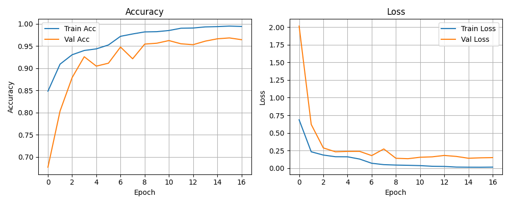

# Face Mask Detection using Deep Learning

This repository presents a deep learning-based face mask detection system developed as part of an internship project at **SkillTexon**, an AI-ML-based training and development company. The primary goal was to design and implement a real-time system capable of identifying whether a person is wearing a face mask or not.

---

## Project Overview

The system classifies individuals in real-time video streams into two categories:
- `with_mask` (green bounding box)
- `without_mask` (red bounding box)

While face detection is a critical part of the pipeline, the emphasis of this project is on **mask classification**. The classifier is robust enough to perform well even without dedicated face detection.

---

## Folder Structure

```
.
├── data/
│   └── Face Mask Dataset (from Kaggle, see below)
├── processed_data/
│   ├── X.npy
│   └── y.npy
├── processed_data_binary/
│   ├── X_Train.npy
│   ├── y_Train.npy
│   ├── X_Validation.npy
│   └── y_Validation.npy
├── face_detection_yunet_2023mar.onnx
├── mask_classifier_best.h5
├── preprosess.py
├── train.py
├── maskdetection.py
└── requirements.txt
```

---

## Dataset

The dataset used is:  
[Face Mask Dataset by Omkar Gurav on Kaggle](https://www.kaggle.com/datasets/omkargurav/face-mask-dataset)  
This dataset is already included in the `data/` directory upon cloning the repository. However, users may replace it with another dataset of their choice. If so, adjust `preprosess.py` accordingly to ensure correct preprocessing.

---

## Preprocessing

- Handled in `preprosess.py`
- All images are resized to 128×128
- Normalization is applied
- Binary labels: `0` = with_mask, `1` = without_mask

---

## Training

The training process is defined in `train.py`:
- Model: CNN with 3 convolution blocks, followed by dense layers
- Output layer uses sigmoid activation for binary classification
- Best model saved as `mask_classifier_best.h5`
- Training plots saved as `training_metrics.png`

To retrain:
```bash
python train.py
```

---

## Inference

Script: `maskdetection.py`

- Uses **YuNet** ONNX face detector: `face_detection_yunet_2023mar.onnx`
- Crops faces and classifies them
- Displays bounding box with confidence

Run with:
```bash
python maskdetection.py
```

Note: The current implementation uses the YuNet Face Detector, which may occasionally fail to detect faces in certain lighting or occlusion conditions. Since the primary focus of the project is mask detection and not robust face detection, this trade-off was acceptable. Users may replace the face detector with a more advanced one (e.g., RetinaFace, MTCNN) for improved detection accuracy.


## Face Detection Model (YuNet)

Model: [`face_detection_yunet_2023mar.onnx`](https://github.com/opencv/opencv_zoo/tree/main/models/face_detection_yunet)

YuNet is a lightweight and efficient face detector. Although not the most accurate, it offers a good trade-off between performance and speed for real-time applications.

---

## Requirements

Install all dependencies using:

```bash
pip install -r requirements.txt
```

---

## Results

Below is the training performance graph (`assets/training_metrics.png`):



---

## Demo
Below is the demo video of this project


---

## Acknowledgements

- **Dataset**: [Face Mask Dataset](https://www.kaggle.com/datasets/omkargurav/face-mask-dataset) by Omkar Gurav – licensed under CC0.
- **Face Detection**: [YuNet Face Detection](https://github.com/opencv/opencv_zoo/tree/main/models/face_detection_yunet) by the OpenCV team.
- **Internship**: Conducted at [SkillTexon](https://skilltexon.com/) under the AI/ML Internship Program.

I acknowledge and thank the creators of the above resources for their valuable contributions.

---

## Author

**Name**: Deepak Sharma  
**Email**: deepak2004402@gmail.com  
**LinkedIn**: [linkedin.com/in/username](https://www.linkedin.com/in/deepak-sharma-0444b632a/)  
**Affiliation**: AI/ML Intern, SkillTexon

---

## License

This project is licensed under the MIT License 
